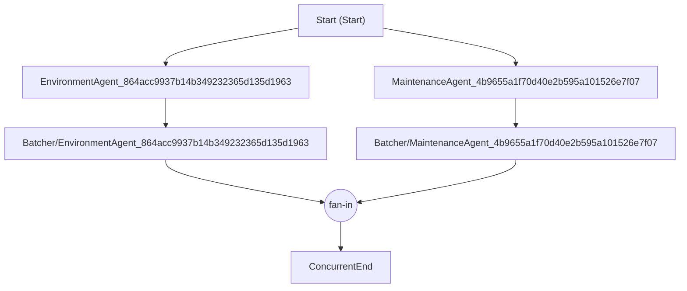

# Workflow Diagram

```mermaid
flowchart TD
  Start["Start (Start)"];
  MaintenanceAgent_4b9655a1f70d40e2b595a101526e7f07["MaintenanceAgent_4b9655a1f70d40e2b595a101526e7f07"];
  EnvironmentAgent_864acc9937b14b349232365d135d1963["EnvironmentAgent_864acc9937b14b349232365d135d1963"];
  Batcher_MaintenanceAgent_4b9655a1f70d40e2b595a101526e7f07["Batcher/MaintenanceAgent_4b9655a1f70d40e2b595a101526e7f07"];
  Batcher_EnvironmentAgent_864acc9937b14b349232365d135d1963["Batcher/EnvironmentAgent_864acc9937b14b349232365d135d1963"];
  ConcurrentEnd["ConcurrentEnd"];

  fan_in_ConcurrentEnd_A9D40AE8((fan-in))
  Batcher_EnvironmentAgent_864acc9937b14b349232365d135d1963 --> fan_in_ConcurrentEnd_A9D40AE8;
  Batcher_MaintenanceAgent_4b9655a1f70d40e2b595a101526e7f07 --> fan_in_ConcurrentEnd_A9D40AE8;
  fan_in_ConcurrentEnd_A9D40AE8 --> ConcurrentEnd;
  Start --> MaintenanceAgent_4b9655a1f70d40e2b595a101526e7f07;
  Start --> EnvironmentAgent_864acc9937b14b349232365d135d1963;
  MaintenanceAgent_4b9655a1f70d40e2b595a101526e7f07 --> Batcher_MaintenanceAgent_4b9655a1f70d40e2b595a101526e7f07;
  EnvironmentAgent_864acc9937b14b349232365d135d1963 --> Batcher_EnvironmentAgent_864acc9937b14b349232365d135d1963;
```
