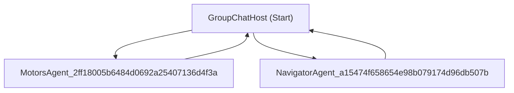

# Workflow Diagram

```mermaid
flowchart TD
  GroupChatHost["GroupChatHost (Start)"];
  MotorsAgent_2ff18005b6484d0692a25407136d4f3a["MotorsAgent_2ff18005b6484d0692a25407136d4f3a"];
  NavigatorAgent_a15474f658654e98b079174d96db507b["NavigatorAgent_a15474f658654e98b079174d96db507b"];
  GroupChatHost --> MotorsAgent_2ff18005b6484d0692a25407136d4f3a;
  GroupChatHost --> NavigatorAgent_a15474f658654e98b079174d96db507b;
  MotorsAgent_2ff18005b6484d0692a25407136d4f3a --> GroupChatHost;
  NavigatorAgent_a15474f658654e98b079174d96db507b --> GroupChatHost;
```
