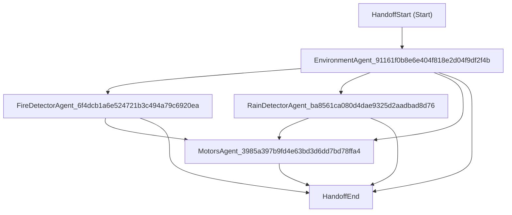

# Workflow Diagram

```mermaid
flowchart TD
  HandoffStart["HandoffStart (Start)"];
  EnvironmentAgent_91161f0b8e6e404f818e2d04f9df2f4b["EnvironmentAgent_91161f0b8e6e404f818e2d04f9df2f4b"];
  FireDetectorAgent_6f4dcb1a6e524721b3c494a79c6920ea["FireDetectorAgent_6f4dcb1a6e524721b3c494a79c6920ea"];
  RainDetectorAgent_ba8561ca080d4dae9325d2aadbad8d76["RainDetectorAgent_ba8561ca080d4dae9325d2aadbad8d76"];
  MotorsAgent_3985a397b9fd4e63bd3d6dd7bd78ffa4["MotorsAgent_3985a397b9fd4e63bd3d6dd7bd78ffa4"];
  HandoffEnd["HandoffEnd"];
  EnvironmentAgent_91161f0b8e6e404f818e2d04f9df2f4b --> FireDetectorAgent_6f4dcb1a6e524721b3c494a79c6920ea;
  EnvironmentAgent_91161f0b8e6e404f818e2d04f9df2f4b --> RainDetectorAgent_ba8561ca080d4dae9325d2aadbad8d76;
  EnvironmentAgent_91161f0b8e6e404f818e2d04f9df2f4b --> MotorsAgent_3985a397b9fd4e63bd3d6dd7bd78ffa4;
  EnvironmentAgent_91161f0b8e6e404f818e2d04f9df2f4b --> HandoffEnd;
  FireDetectorAgent_6f4dcb1a6e524721b3c494a79c6920ea --> MotorsAgent_3985a397b9fd4e63bd3d6dd7bd78ffa4;
  FireDetectorAgent_6f4dcb1a6e524721b3c494a79c6920ea --> HandoffEnd;
  RainDetectorAgent_ba8561ca080d4dae9325d2aadbad8d76 --> MotorsAgent_3985a397b9fd4e63bd3d6dd7bd78ffa4;
  RainDetectorAgent_ba8561ca080d4dae9325d2aadbad8d76 --> HandoffEnd;
  MotorsAgent_3985a397b9fd4e63bd3d6dd7bd78ffa4 --> HandoffEnd;
  HandoffStart --> EnvironmentAgent_91161f0b8e6e404f818e2d04f9df2f4b;
```
