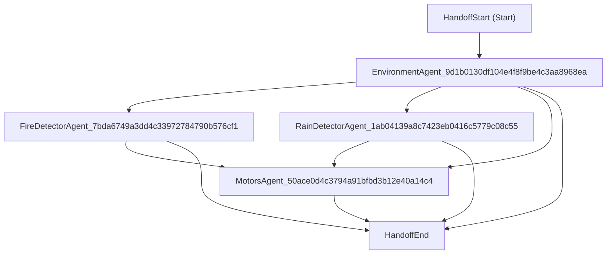

# Workflow Diagram

```mermaid
flowchart TD
  HandoffStart["HandoffStart (Start)"];
  EnvironmentAgent_9d1b0130df104e4f8f9be4c3aa8968ea["EnvironmentAgent_9d1b0130df104e4f8f9be4c3aa8968ea"];
  FireDetectorAgent_7bda6749a3dd4c33972784790b576cf1["FireDetectorAgent_7bda6749a3dd4c33972784790b576cf1"];
  RainDetectorAgent_1ab04139a8c7423eb0416c5779c08c55["RainDetectorAgent_1ab04139a8c7423eb0416c5779c08c55"];
  MotorsAgent_50ace0d4c3794a91bfbd3b12e40a14c4["MotorsAgent_50ace0d4c3794a91bfbd3b12e40a14c4"];
  HandoffEnd["HandoffEnd"];
  EnvironmentAgent_9d1b0130df104e4f8f9be4c3aa8968ea --> FireDetectorAgent_7bda6749a3dd4c33972784790b576cf1;
  EnvironmentAgent_9d1b0130df104e4f8f9be4c3aa8968ea --> RainDetectorAgent_1ab04139a8c7423eb0416c5779c08c55;
  EnvironmentAgent_9d1b0130df104e4f8f9be4c3aa8968ea --> MotorsAgent_50ace0d4c3794a91bfbd3b12e40a14c4;
  EnvironmentAgent_9d1b0130df104e4f8f9be4c3aa8968ea --> HandoffEnd;
  FireDetectorAgent_7bda6749a3dd4c33972784790b576cf1 --> MotorsAgent_50ace0d4c3794a91bfbd3b12e40a14c4;
  FireDetectorAgent_7bda6749a3dd4c33972784790b576cf1 --> HandoffEnd;
  RainDetectorAgent_1ab04139a8c7423eb0416c5779c08c55 --> MotorsAgent_50ace0d4c3794a91bfbd3b12e40a14c4;
  RainDetectorAgent_1ab04139a8c7423eb0416c5779c08c55 --> HandoffEnd;
  MotorsAgent_50ace0d4c3794a91bfbd3b12e40a14c4 --> HandoffEnd;
  HandoffStart --> EnvironmentAgent_9d1b0130df104e4f8f9be4c3aa8968ea;
```
