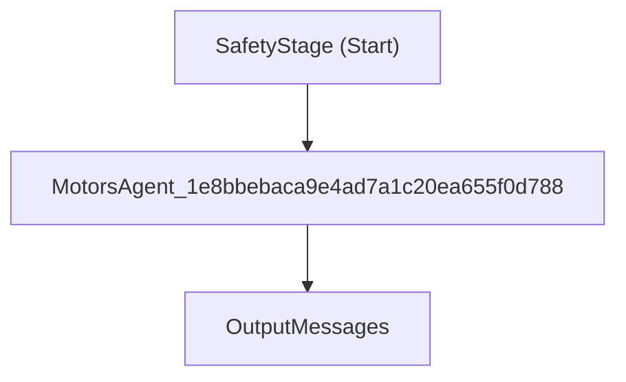

# Workflow Diagram

```mermaid
flowchart TD
  SafetyStage["SafetyStage (Start)"];
  MotorsAgent_1e8bbebaca9e4ad7a1c20ea655f0d788["MotorsAgent_1e8bbebaca9e4ad7a1c20ea655f0d788"];
  OutputMessages["OutputMessages"];
  SafetyStage --> MotorsAgent_1e8bbebaca9e4ad7a1c20ea655f0d788;
  MotorsAgent_1e8bbebaca9e4ad7a1c20ea655f0d788 --> OutputMessages;
```
