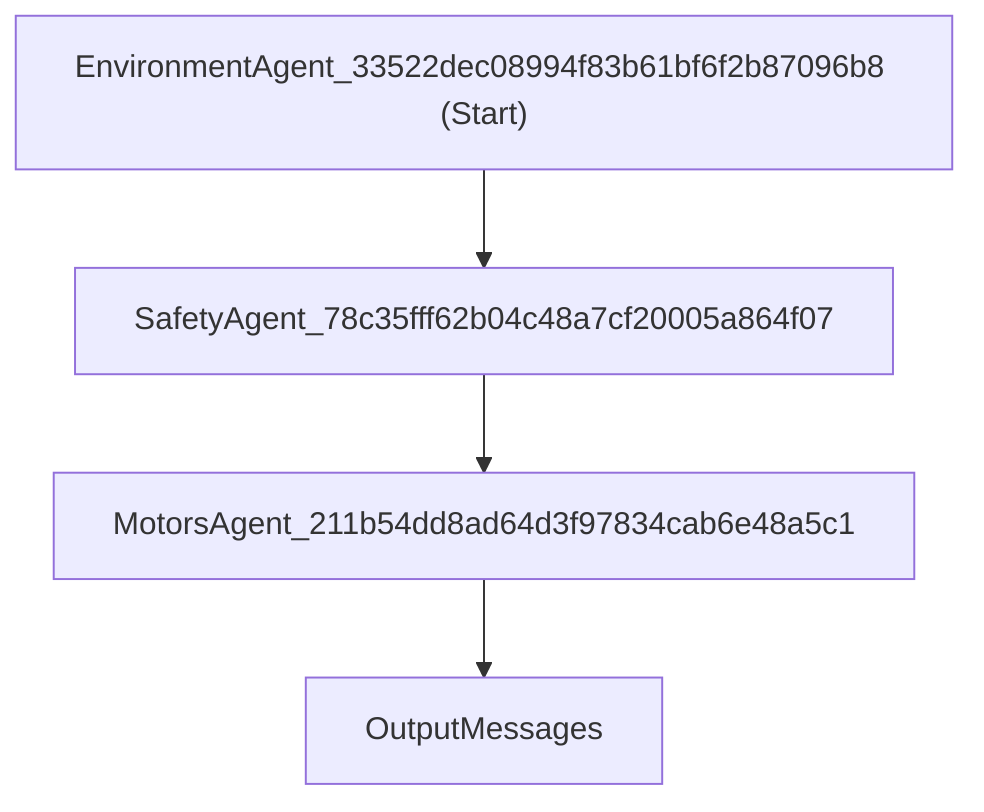

# Workflow Diagram

```mermaid
flowchart TD
  EnvironmentAgent_33522dec08994f83b61bf6f2b87096b8["EnvironmentAgent_33522dec08994f83b61bf6f2b87096b8 (Start)"];
  SafetyAgent_78c35fff62b04c48a7cf20005a864f07["SafetyAgent_78c35fff62b04c48a7cf20005a864f07"];
  MotorsAgent_211b54dd8ad64d3f97834cab6e48a5c1["MotorsAgent_211b54dd8ad64d3f97834cab6e48a5c1"];
  OutputMessages["OutputMessages"];
  EnvironmentAgent_33522dec08994f83b61bf6f2b87096b8 --> SafetyAgent_78c35fff62b04c48a7cf20005a864f07;
  SafetyAgent_78c35fff62b04c48a7cf20005a864f07 --> MotorsAgent_211b54dd8ad64d3f97834cab6e48a5c1;
  MotorsAgent_211b54dd8ad64d3f97834cab6e48a5c1 --> OutputMessages;
```
