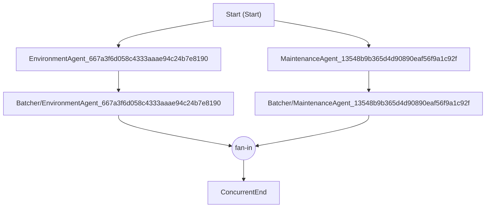

# Workflow Diagram

```mermaid
flowchart TD
  Start["Start (Start)"];
  MaintenanceAgent_13548b9b365d4d90890eaf56f9a1c92f["MaintenanceAgent_13548b9b365d4d90890eaf56f9a1c92f"];
  EnvironmentAgent_667a3f6d058c4333aaae94c24b7e8190["EnvironmentAgent_667a3f6d058c4333aaae94c24b7e8190"];
  Batcher_MaintenanceAgent_13548b9b365d4d90890eaf56f9a1c92f["Batcher/MaintenanceAgent_13548b9b365d4d90890eaf56f9a1c92f"];
  Batcher_EnvironmentAgent_667a3f6d058c4333aaae94c24b7e8190["Batcher/EnvironmentAgent_667a3f6d058c4333aaae94c24b7e8190"];
  ConcurrentEnd["ConcurrentEnd"];

  fan_in_ConcurrentEnd_BD41C658((fan-in))
  Batcher_EnvironmentAgent_667a3f6d058c4333aaae94c24b7e8190 --> fan_in_ConcurrentEnd_BD41C658;
  Batcher_MaintenanceAgent_13548b9b365d4d90890eaf56f9a1c92f --> fan_in_ConcurrentEnd_BD41C658;
  fan_in_ConcurrentEnd_BD41C658 --> ConcurrentEnd;
  Start --> MaintenanceAgent_13548b9b365d4d90890eaf56f9a1c92f;
  Start --> EnvironmentAgent_667a3f6d058c4333aaae94c24b7e8190;
  MaintenanceAgent_13548b9b365d4d90890eaf56f9a1c92f --> Batcher_MaintenanceAgent_13548b9b365d4d90890eaf56f9a1c92f;
  EnvironmentAgent_667a3f6d058c4333aaae94c24b7e8190 --> Batcher_EnvironmentAgent_667a3f6d058c4333aaae94c24b7e8190;
```
