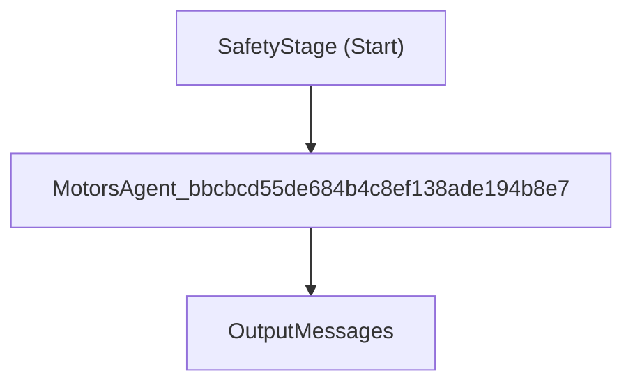

# Workflow Diagram

```mermaid
flowchart TD
  SafetyStage["SafetyStage (Start)"];
  MotorsAgent_bbcbcd55de684b4c8ef138ade194b8e7["MotorsAgent_bbcbcd55de684b4c8ef138ade194b8e7"];
  OutputMessages["OutputMessages"];
  SafetyStage --> MotorsAgent_bbcbcd55de684b4c8ef138ade194b8e7;
  MotorsAgent_bbcbcd55de684b4c8ef138ade194b8e7 --> OutputMessages;
```
