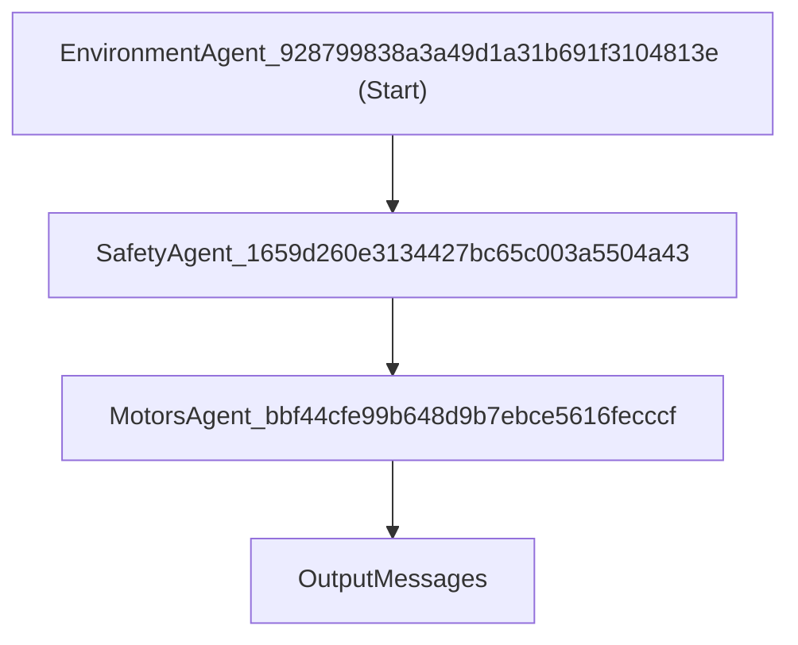

# Workflow Diagram

```mermaid
flowchart TD
  EnvironmentAgent_928799838a3a49d1a31b691f3104813e["EnvironmentAgent_928799838a3a49d1a31b691f3104813e (Start)"];
  SafetyAgent_1659d260e3134427bc65c003a5504a43["SafetyAgent_1659d260e3134427bc65c003a5504a43"];
  MotorsAgent_bbf44cfe99b648d9b7ebce5616fecccf["MotorsAgent_bbf44cfe99b648d9b7ebce5616fecccf"];
  OutputMessages["OutputMessages"];
  EnvironmentAgent_928799838a3a49d1a31b691f3104813e --> SafetyAgent_1659d260e3134427bc65c003a5504a43;
  SafetyAgent_1659d260e3134427bc65c003a5504a43 --> MotorsAgent_bbf44cfe99b648d9b7ebce5616fecccf;
  MotorsAgent_bbf44cfe99b648d9b7ebce5616fecccf --> OutputMessages;
```
