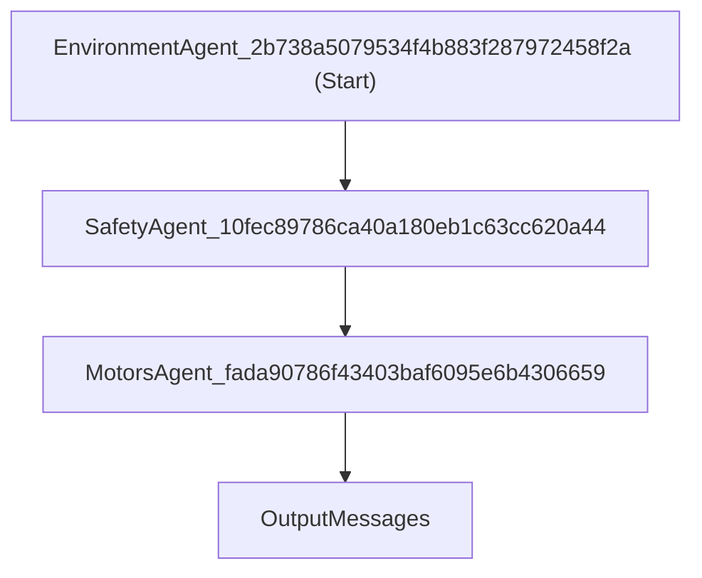

# Workflow Diagram

```mermaid
flowchart TD
  EnvironmentAgent_2b738a5079534f4b883f287972458f2a["EnvironmentAgent_2b738a5079534f4b883f287972458f2a (Start)"];
  SafetyAgent_10fec89786ca40a180eb1c63cc620a44["SafetyAgent_10fec89786ca40a180eb1c63cc620a44"];
  MotorsAgent_fada90786f43403baf6095e6b4306659["MotorsAgent_fada90786f43403baf6095e6b4306659"];
  OutputMessages["OutputMessages"];
  EnvironmentAgent_2b738a5079534f4b883f287972458f2a --> SafetyAgent_10fec89786ca40a180eb1c63cc620a44;
  SafetyAgent_10fec89786ca40a180eb1c63cc620a44 --> MotorsAgent_fada90786f43403baf6095e6b4306659;
  MotorsAgent_fada90786f43403baf6095e6b4306659 --> OutputMessages;
```
