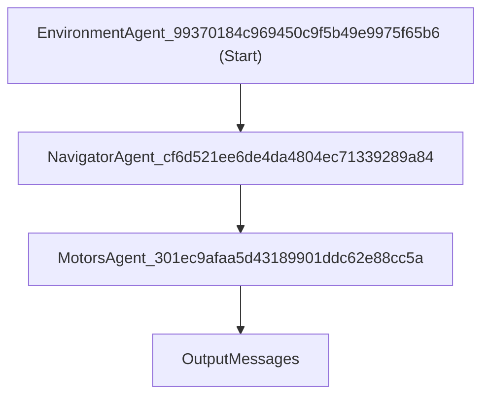

# Workflow Diagram

```mermaid
flowchart TD
  EnvironmentAgent_99370184c969450c9f5b49e9975f65b6["EnvironmentAgent_99370184c969450c9f5b49e9975f65b6 (Start)"];
  NavigatorAgent_cf6d521ee6de4da4804ec71339289a84["NavigatorAgent_cf6d521ee6de4da4804ec71339289a84"];
  MotorsAgent_301ec9afaa5d43189901ddc62e88cc5a["MotorsAgent_301ec9afaa5d43189901ddc62e88cc5a"];
  OutputMessages["OutputMessages"];
  EnvironmentAgent_99370184c969450c9f5b49e9975f65b6 --> NavigatorAgent_cf6d521ee6de4da4804ec71339289a84;
  NavigatorAgent_cf6d521ee6de4da4804ec71339289a84 --> MotorsAgent_301ec9afaa5d43189901ddc62e88cc5a;
  MotorsAgent_301ec9afaa5d43189901ddc62e88cc5a --> OutputMessages;
```
