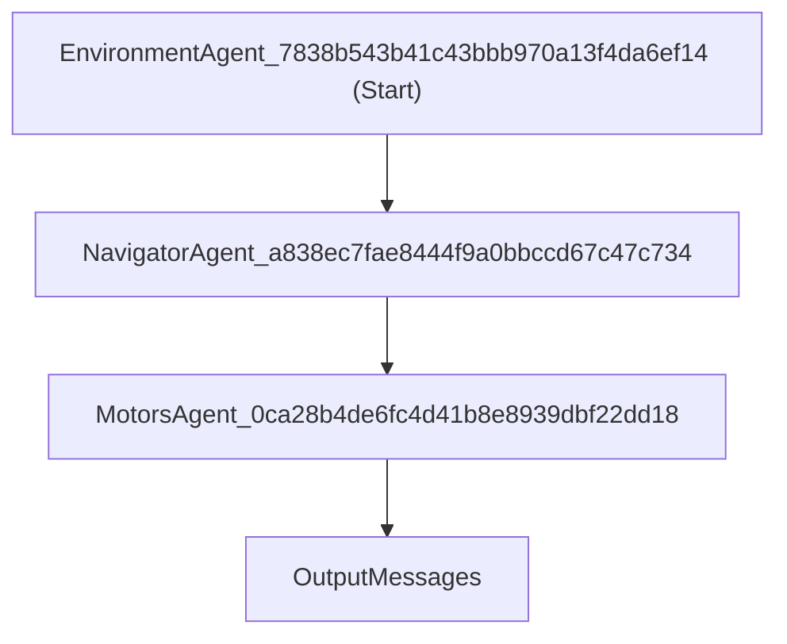

# Workflow Diagram

```mermaid
flowchart TD
  EnvironmentAgent_7838b543b41c43bbb970a13f4da6ef14["EnvironmentAgent_7838b543b41c43bbb970a13f4da6ef14 (Start)"];
  NavigatorAgent_a838ec7fae8444f9a0bbccd67c47c734["NavigatorAgent_a838ec7fae8444f9a0bbccd67c47c734"];
  MotorsAgent_0ca28b4de6fc4d41b8e8939dbf22dd18["MotorsAgent_0ca28b4de6fc4d41b8e8939dbf22dd18"];
  OutputMessages["OutputMessages"];
  EnvironmentAgent_7838b543b41c43bbb970a13f4da6ef14 --> NavigatorAgent_a838ec7fae8444f9a0bbccd67c47c734;
  NavigatorAgent_a838ec7fae8444f9a0bbccd67c47c734 --> MotorsAgent_0ca28b4de6fc4d41b8e8939dbf22dd18;
  MotorsAgent_0ca28b4de6fc4d41b8e8939dbf22dd18 --> OutputMessages;
```
