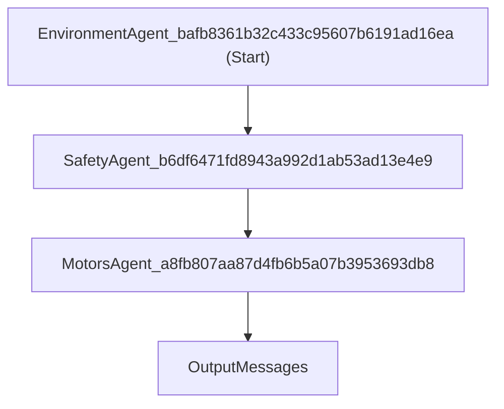

# Workflow Diagram

```mermaid
flowchart TD
  EnvironmentAgent_bafb8361b32c433c95607b6191ad16ea["EnvironmentAgent_bafb8361b32c433c95607b6191ad16ea (Start)"];
  SafetyAgent_b6df6471fd8943a992d1ab53ad13e4e9["SafetyAgent_b6df6471fd8943a992d1ab53ad13e4e9"];
  MotorsAgent_a8fb807aa87d4fb6b5a07b3953693db8["MotorsAgent_a8fb807aa87d4fb6b5a07b3953693db8"];
  OutputMessages["OutputMessages"];
  EnvironmentAgent_bafb8361b32c433c95607b6191ad16ea --> SafetyAgent_b6df6471fd8943a992d1ab53ad13e4e9;
  SafetyAgent_b6df6471fd8943a992d1ab53ad13e4e9 --> MotorsAgent_a8fb807aa87d4fb6b5a07b3953693db8;
  MotorsAgent_a8fb807aa87d4fb6b5a07b3953693db8 --> OutputMessages;
```
