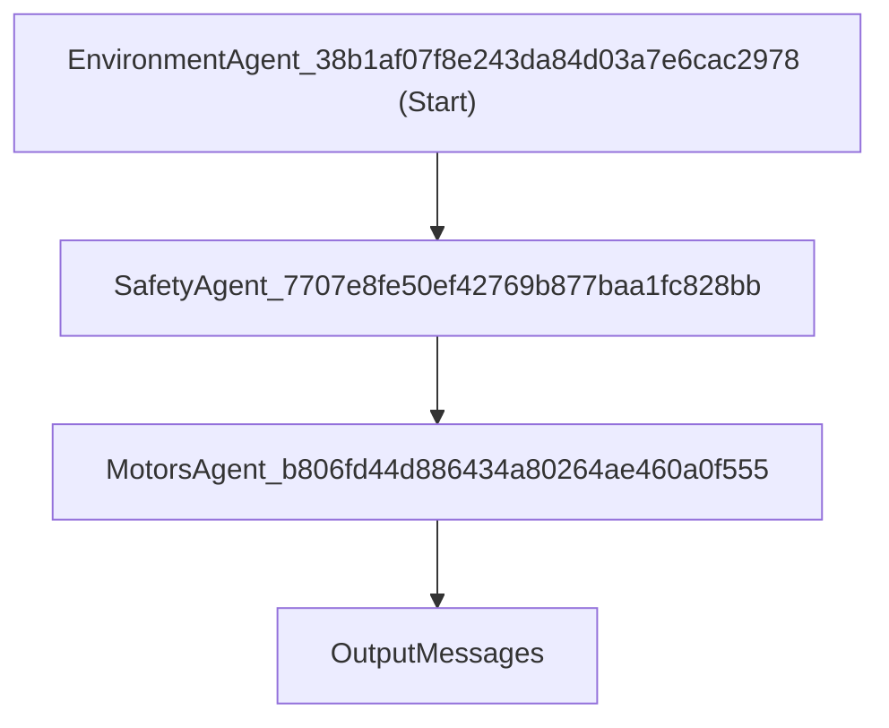

# Workflow Diagram

```mermaid
flowchart TD
  EnvironmentAgent_38b1af07f8e243da84d03a7e6cac2978["EnvironmentAgent_38b1af07f8e243da84d03a7e6cac2978 (Start)"];
  SafetyAgent_7707e8fe50ef42769b877baa1fc828bb["SafetyAgent_7707e8fe50ef42769b877baa1fc828bb"];
  MotorsAgent_b806fd44d886434a80264ae460a0f555["MotorsAgent_b806fd44d886434a80264ae460a0f555"];
  OutputMessages["OutputMessages"];
  EnvironmentAgent_38b1af07f8e243da84d03a7e6cac2978 --> SafetyAgent_7707e8fe50ef42769b877baa1fc828bb;
  SafetyAgent_7707e8fe50ef42769b877baa1fc828bb --> MotorsAgent_b806fd44d886434a80264ae460a0f555;
  MotorsAgent_b806fd44d886434a80264ae460a0f555 --> OutputMessages;
```
