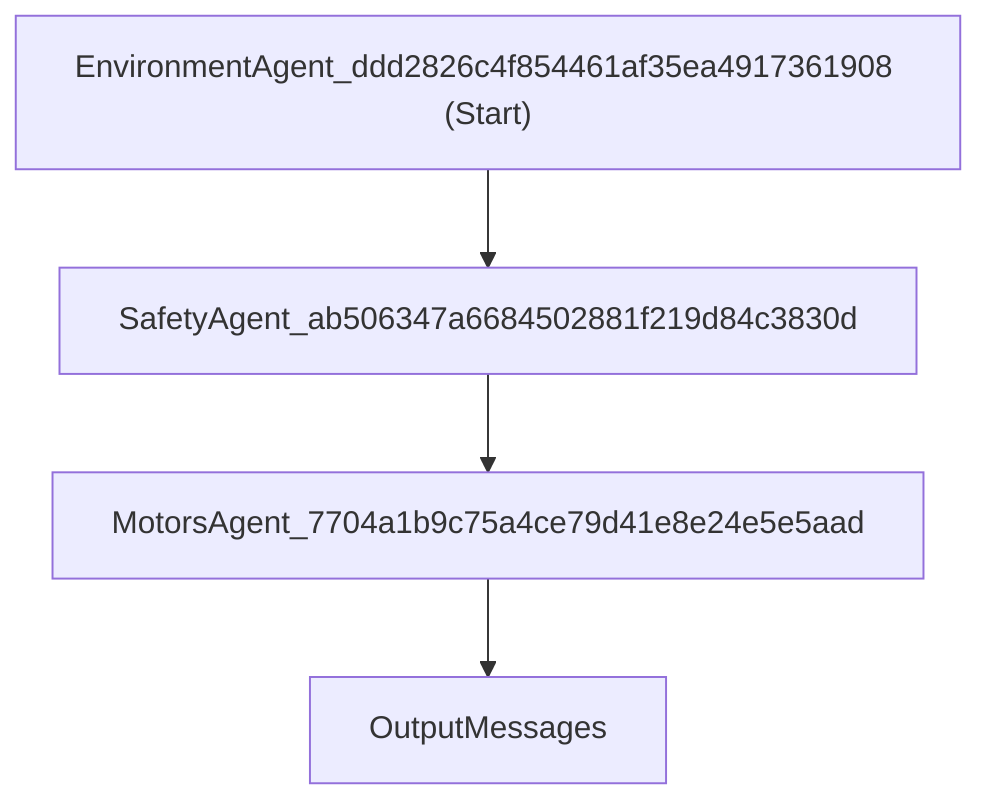

# Workflow Diagram

```mermaid
flowchart TD
  EnvironmentAgent_ddd2826c4f854461af35ea4917361908["EnvironmentAgent_ddd2826c4f854461af35ea4917361908 (Start)"];
  SafetyAgent_ab506347a6684502881f219d84c3830d["SafetyAgent_ab506347a6684502881f219d84c3830d"];
  MotorsAgent_7704a1b9c75a4ce79d41e8e24e5e5aad["MotorsAgent_7704a1b9c75a4ce79d41e8e24e5e5aad"];
  OutputMessages["OutputMessages"];
  EnvironmentAgent_ddd2826c4f854461af35ea4917361908 --> SafetyAgent_ab506347a6684502881f219d84c3830d;
  SafetyAgent_ab506347a6684502881f219d84c3830d --> MotorsAgent_7704a1b9c75a4ce79d41e8e24e5e5aad;
  MotorsAgent_7704a1b9c75a4ce79d41e8e24e5e5aad --> OutputMessages;
```
