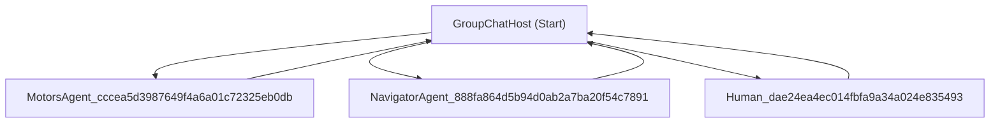

# Workflow Diagram

```mermaid
flowchart TD
  GroupChatHost["GroupChatHost (Start)"];
  MotorsAgent_cccea5d3987649f4a6a01c72325eb0db["MotorsAgent_cccea5d3987649f4a6a01c72325eb0db"];
  NavigatorAgent_888fa864d5b94d0ab2a7ba20f54c7891["NavigatorAgent_888fa864d5b94d0ab2a7ba20f54c7891"];
  Human_dae24ea4ec014fbfa9a34a024e835493["Human_dae24ea4ec014fbfa9a34a024e835493"];
  GroupChatHost --> MotorsAgent_cccea5d3987649f4a6a01c72325eb0db;
  GroupChatHost --> NavigatorAgent_888fa864d5b94d0ab2a7ba20f54c7891;
  GroupChatHost --> Human_dae24ea4ec014fbfa9a34a024e835493;
  MotorsAgent_cccea5d3987649f4a6a01c72325eb0db --> GroupChatHost;
  NavigatorAgent_888fa864d5b94d0ab2a7ba20f54c7891 --> GroupChatHost;
  Human_dae24ea4ec014fbfa9a34a024e835493 --> GroupChatHost;
```
