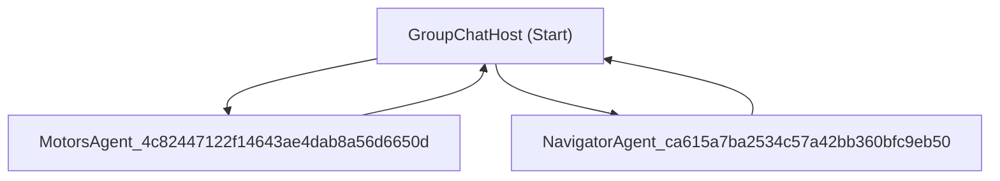

# Workflow Diagram

```mermaid
flowchart TD
  GroupChatHost["GroupChatHost (Start)"];
  MotorsAgent_4c82447122f14643ae4dab8a56d6650d["MotorsAgent_4c82447122f14643ae4dab8a56d6650d"];
  NavigatorAgent_ca615a7ba2534c57a42bb360bfc9eb50["NavigatorAgent_ca615a7ba2534c57a42bb360bfc9eb50"];
  GroupChatHost --> MotorsAgent_4c82447122f14643ae4dab8a56d6650d;
  GroupChatHost --> NavigatorAgent_ca615a7ba2534c57a42bb360bfc9eb50;
  MotorsAgent_4c82447122f14643ae4dab8a56d6650d --> GroupChatHost;
  NavigatorAgent_ca615a7ba2534c57a42bb360bfc9eb50 --> GroupChatHost;
```
