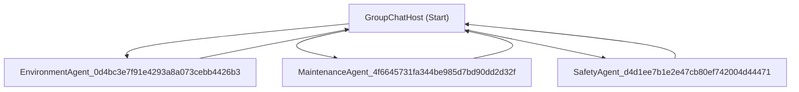

# Workflow Diagram

```mermaid
flowchart TD
  GroupChatHost["GroupChatHost (Start)"];
  EnvironmentAgent_0d4bc3e7f91e4293a8a073cebb4426b3["EnvironmentAgent_0d4bc3e7f91e4293a8a073cebb4426b3"];
  MaintenanceAgent_4f6645731fa344be985d7bd90dd2d32f["MaintenanceAgent_4f6645731fa344be985d7bd90dd2d32f"];
  SafetyAgent_d4d1ee7b1e2e47cb80ef742004d44471["SafetyAgent_d4d1ee7b1e2e47cb80ef742004d44471"];
  GroupChatHost --> EnvironmentAgent_0d4bc3e7f91e4293a8a073cebb4426b3;
  GroupChatHost --> MaintenanceAgent_4f6645731fa344be985d7bd90dd2d32f;
  GroupChatHost --> SafetyAgent_d4d1ee7b1e2e47cb80ef742004d44471;
  EnvironmentAgent_0d4bc3e7f91e4293a8a073cebb4426b3 --> GroupChatHost;
  MaintenanceAgent_4f6645731fa344be985d7bd90dd2d32f --> GroupChatHost;
  SafetyAgent_d4d1ee7b1e2e47cb80ef742004d44471 --> GroupChatHost;
```
