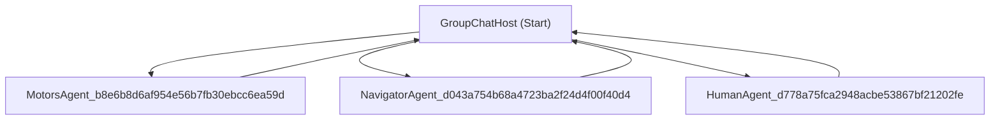

# Workflow Diagram

```mermaid
flowchart TD
  GroupChatHost["GroupChatHost (Start)"];
  MotorsAgent_b8e6b8d6af954e56b7fb30ebcc6ea59d["MotorsAgent_b8e6b8d6af954e56b7fb30ebcc6ea59d"];
  NavigatorAgent_d043a754b68a4723ba2f24d4f00f40d4["NavigatorAgent_d043a754b68a4723ba2f24d4f00f40d4"];
  HumanAgent_d778a75fca2948acbe53867bf21202fe["HumanAgent_d778a75fca2948acbe53867bf21202fe"];
  GroupChatHost --> MotorsAgent_b8e6b8d6af954e56b7fb30ebcc6ea59d;
  GroupChatHost --> NavigatorAgent_d043a754b68a4723ba2f24d4f00f40d4;
  GroupChatHost --> HumanAgent_d778a75fca2948acbe53867bf21202fe;
  MotorsAgent_b8e6b8d6af954e56b7fb30ebcc6ea59d --> GroupChatHost;
  NavigatorAgent_d043a754b68a4723ba2f24d4f00f40d4 --> GroupChatHost;
  HumanAgent_d778a75fca2948acbe53867bf21202fe --> GroupChatHost;
```
