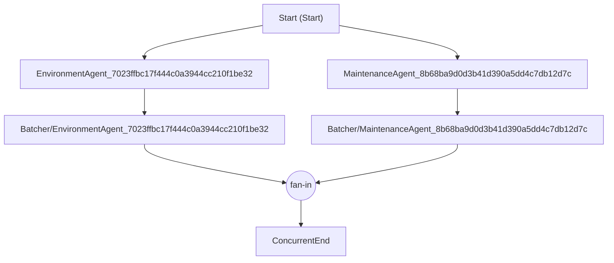

# Workflow Diagram

```mermaid
flowchart TD
  Start["Start (Start)"];
  MaintenanceAgent_8b68ba9d0d3b41d390a5dd4c7db12d7c["MaintenanceAgent_8b68ba9d0d3b41d390a5dd4c7db12d7c"];
  EnvironmentAgent_7023ffbc17f444c0a3944cc210f1be32["EnvironmentAgent_7023ffbc17f444c0a3944cc210f1be32"];
  Batcher_MaintenanceAgent_8b68ba9d0d3b41d390a5dd4c7db12d7c["Batcher/MaintenanceAgent_8b68ba9d0d3b41d390a5dd4c7db12d7c"];
  Batcher_EnvironmentAgent_7023ffbc17f444c0a3944cc210f1be32["Batcher/EnvironmentAgent_7023ffbc17f444c0a3944cc210f1be32"];
  ConcurrentEnd["ConcurrentEnd"];

  fan_in_ConcurrentEnd_830818C9((fan-in))
  Batcher_EnvironmentAgent_7023ffbc17f444c0a3944cc210f1be32 --> fan_in_ConcurrentEnd_830818C9;
  Batcher_MaintenanceAgent_8b68ba9d0d3b41d390a5dd4c7db12d7c --> fan_in_ConcurrentEnd_830818C9;
  fan_in_ConcurrentEnd_830818C9 --> ConcurrentEnd;
  Start --> MaintenanceAgent_8b68ba9d0d3b41d390a5dd4c7db12d7c;
  Start --> EnvironmentAgent_7023ffbc17f444c0a3944cc210f1be32;
  MaintenanceAgent_8b68ba9d0d3b41d390a5dd4c7db12d7c --> Batcher_MaintenanceAgent_8b68ba9d0d3b41d390a5dd4c7db12d7c;
  EnvironmentAgent_7023ffbc17f444c0a3944cc210f1be32 --> Batcher_EnvironmentAgent_7023ffbc17f444c0a3944cc210f1be32;
```
