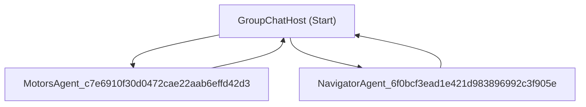

# Workflow Diagram

```mermaid
flowchart TD
  GroupChatHost["GroupChatHost (Start)"];
  MotorsAgent_c7e6910f30d0472cae22aab6effd42d3["MotorsAgent_c7e6910f30d0472cae22aab6effd42d3"];
  NavigatorAgent_6f0bcf3ead1e421d983896992c3f905e["NavigatorAgent_6f0bcf3ead1e421d983896992c3f905e"];
  GroupChatHost --> MotorsAgent_c7e6910f30d0472cae22aab6effd42d3;
  GroupChatHost --> NavigatorAgent_6f0bcf3ead1e421d983896992c3f905e;
  MotorsAgent_c7e6910f30d0472cae22aab6effd42d3 --> GroupChatHost;
  NavigatorAgent_6f0bcf3ead1e421d983896992c3f905e --> GroupChatHost;
```
