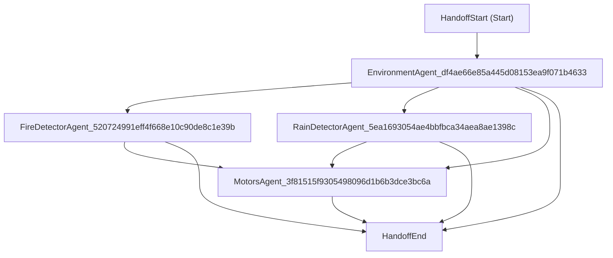

# Workflow Diagram

```mermaid
flowchart TD
  HandoffStart["HandoffStart (Start)"];
  EnvironmentAgent_df4ae66e85a445d08153ea9f071b4633["EnvironmentAgent_df4ae66e85a445d08153ea9f071b4633"];
  FireDetectorAgent_520724991eff4f668e10c90de8c1e39b["FireDetectorAgent_520724991eff4f668e10c90de8c1e39b"];
  RainDetectorAgent_5ea1693054ae4bbfbca34aea8ae1398c["RainDetectorAgent_5ea1693054ae4bbfbca34aea8ae1398c"];
  MotorsAgent_3f81515f9305498096d1b6b3dce3bc6a["MotorsAgent_3f81515f9305498096d1b6b3dce3bc6a"];
  HandoffEnd["HandoffEnd"];
  EnvironmentAgent_df4ae66e85a445d08153ea9f071b4633 --> FireDetectorAgent_520724991eff4f668e10c90de8c1e39b;
  EnvironmentAgent_df4ae66e85a445d08153ea9f071b4633 --> RainDetectorAgent_5ea1693054ae4bbfbca34aea8ae1398c;
  EnvironmentAgent_df4ae66e85a445d08153ea9f071b4633 --> MotorsAgent_3f81515f9305498096d1b6b3dce3bc6a;
  EnvironmentAgent_df4ae66e85a445d08153ea9f071b4633 --> HandoffEnd;
  FireDetectorAgent_520724991eff4f668e10c90de8c1e39b --> MotorsAgent_3f81515f9305498096d1b6b3dce3bc6a;
  FireDetectorAgent_520724991eff4f668e10c90de8c1e39b --> HandoffEnd;
  RainDetectorAgent_5ea1693054ae4bbfbca34aea8ae1398c --> MotorsAgent_3f81515f9305498096d1b6b3dce3bc6a;
  RainDetectorAgent_5ea1693054ae4bbfbca34aea8ae1398c --> HandoffEnd;
  MotorsAgent_3f81515f9305498096d1b6b3dce3bc6a --> HandoffEnd;
  HandoffStart --> EnvironmentAgent_df4ae66e85a445d08153ea9f071b4633;
```
