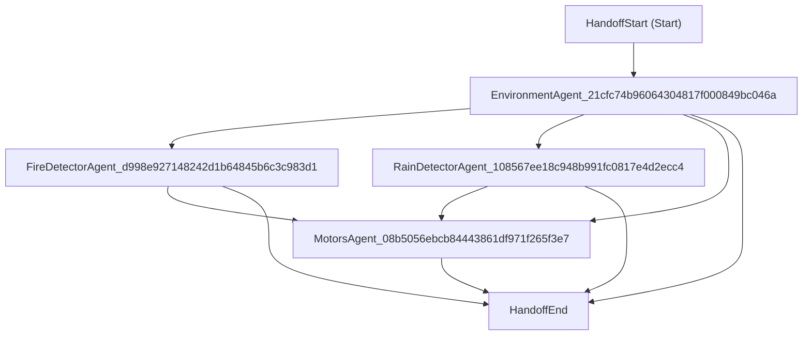

# Workflow Diagram

```mermaid
flowchart TD
  HandoffStart["HandoffStart (Start)"];
  EnvironmentAgent_21cfc74b96064304817f000849bc046a["EnvironmentAgent_21cfc74b96064304817f000849bc046a"];
  FireDetectorAgent_d998e927148242d1b64845b6c3c983d1["FireDetectorAgent_d998e927148242d1b64845b6c3c983d1"];
  RainDetectorAgent_108567ee18c948b991fc0817e4d2ecc4["RainDetectorAgent_108567ee18c948b991fc0817e4d2ecc4"];
  MotorsAgent_08b5056ebcb84443861df971f265f3e7["MotorsAgent_08b5056ebcb84443861df971f265f3e7"];
  HandoffEnd["HandoffEnd"];
  EnvironmentAgent_21cfc74b96064304817f000849bc046a --> FireDetectorAgent_d998e927148242d1b64845b6c3c983d1;
  EnvironmentAgent_21cfc74b96064304817f000849bc046a --> RainDetectorAgent_108567ee18c948b991fc0817e4d2ecc4;
  EnvironmentAgent_21cfc74b96064304817f000849bc046a --> MotorsAgent_08b5056ebcb84443861df971f265f3e7;
  EnvironmentAgent_21cfc74b96064304817f000849bc046a --> HandoffEnd;
  FireDetectorAgent_d998e927148242d1b64845b6c3c983d1 --> MotorsAgent_08b5056ebcb84443861df971f265f3e7;
  FireDetectorAgent_d998e927148242d1b64845b6c3c983d1 --> HandoffEnd;
  RainDetectorAgent_108567ee18c948b991fc0817e4d2ecc4 --> MotorsAgent_08b5056ebcb84443861df971f265f3e7;
  RainDetectorAgent_108567ee18c948b991fc0817e4d2ecc4 --> HandoffEnd;
  MotorsAgent_08b5056ebcb84443861df971f265f3e7 --> HandoffEnd;
  HandoffStart --> EnvironmentAgent_21cfc74b96064304817f000849bc046a;
```
