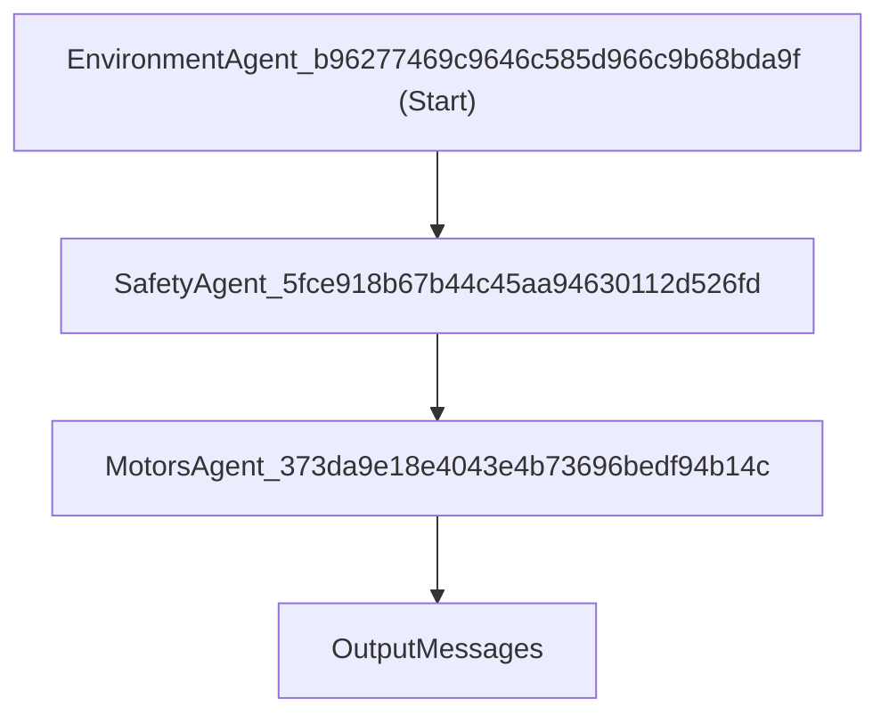

# Workflow Diagram

```mermaid
flowchart TD
  EnvironmentAgent_b96277469c9646c585d966c9b68bda9f["EnvironmentAgent_b96277469c9646c585d966c9b68bda9f (Start)"];
  SafetyAgent_5fce918b67b44c45aa94630112d526fd["SafetyAgent_5fce918b67b44c45aa94630112d526fd"];
  MotorsAgent_373da9e18e4043e4b73696bedf94b14c["MotorsAgent_373da9e18e4043e4b73696bedf94b14c"];
  OutputMessages["OutputMessages"];
  EnvironmentAgent_b96277469c9646c585d966c9b68bda9f --> SafetyAgent_5fce918b67b44c45aa94630112d526fd;
  SafetyAgent_5fce918b67b44c45aa94630112d526fd --> MotorsAgent_373da9e18e4043e4b73696bedf94b14c;
  MotorsAgent_373da9e18e4043e4b73696bedf94b14c --> OutputMessages;
```
